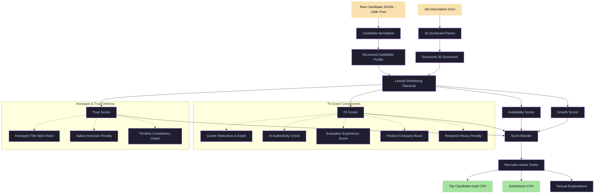

# IntentRank — Recruiter-Aware Candidate Discovery Engine

[](https://www.python.org/)
[](LICENSE)
[](https://redrob.com/)

**IntentRank** is a candidate evaluation and ranking engine built for the Redrob Intelligent Candidate Discovery & Ranking Challenge. 

Unlike conventional keyword-matching tools that are easily fooled by resume inflation, IntentRank models the decision-making process of an experienced technical recruiter. It combines job requirements, career progression, behavioral signals, and verified trust checks into a multi-dimensional ranking score.

---

## 🏗️ System Architecture

IntentRank is structured as a decoupled, CPU-friendly pipeline designed to run efficiently on 100K+ candidate profiles within runtime constraints:



---

## 🧠 Key Features & Ranking Heuristics

### 1. Candidate Intelligence Layer
Normalizes raw unstructured JSON profiles into high-fidelity structured data, exposing work history durations, exact notice periods, locations, and recruiter response rates.

### 2. Multi-Score Ranking Formula
Instead of a single score, candidates are evaluated across four key dimensions:
* **Fit Score (55%):** Assesses technical depth in retrieval, search, recommendation systems, product-company background, and evaluation frameworks.
* **Trust Score (20%):** Detects discrepancies, timeline inflation, unverified contact details, or generic keyword stuffing.
* **Growth Score (15%):** Computes career trajectory speed, promotion velocities, and leadership roles.
* **Availability Score (10%):** Factors in active seeking status, notice periods, and recent activity.

### 3. Advanced Recruiting Rules
* **Career Depth:** Prefers sustained multi-year experience in search/ranking systems over simple keyword occurrences.
* **AI Authenticity:** Penalizes candidates who declare expertise in modern terms (e.g., RAG, LLMs, LangChain) without supporting role history.
* **Research Penalty:** Differentiates applied/research scientists with production deployment history from research-only backgrounds.
* **Evaluation Frameworks:** Specifically scans for experience with ranking evaluation metrics (`NDCG`, `MRR`, `MAP`, `A/B testing`), as requested by the job description.

---

## 🛡️ Honeypot Protection

The Redrob challenge dataset contains deceptive profiles and keyword-stuffed entries. IntentRank uses a multi-layered defense to penalize them:
1. **Title-Skill Mismatch:** Flags non-technical roles (e.g., Sales, Marketing) claiming advanced ML skills like `PEFT`, `LoRA`, or `Information Retrieval`.
2. **Salary Inversion Check:** Catches invalid salary expectations where minimums exceed maximums.
3. **Engagement Inconsistency:** Detects profiles with low completeness but high recruiter saves (indicative of artificial profiles).

---

## 📊 Score Calibration & Optimization

### Solving Score Saturation
Earlier iterations suffered from "score saturation," where the top candidates all clustered at a perfect `100.0` fit score. We introduced subscore caps, late-saturating metrics, and specialized penalties to ensure candidates are highly differentiated. 

### Weight Optimization Results
By grid-searching candidate weights against **80 manual recruiter labels** (graded `2` = Strong, `1` = Maybe, `0` = Reject), we calibrated the formula to achieve the following performance metrics:

* **P@10 Good-Fit:** `1.000` (Every top 10 candidate is a viable interview)
* **NDCG@10:** `0.891`
* **NDCG@20:** `0.877`

---

## 📁 Repository Structure

```text
├── rank.py                       # Main pipeline CLI entrypoint
├── audit_top_candidates.py       # Generates CSV audit for human verification
├── eval_local.py                 # Interactive labeling and proxy metrics
├── optimize_weights.py           # Runs grid search to optimize subscore weights
├── config/
│   ├── jd_scorecard.yaml         # Structured JD requirements
│   └── weights.yaml              # Scoring weights and hyperparameter config
├── src/
│   ├── candidate_normalizer.py   # Cleans and structures raw profiles
│   ├── scorer_fit.py             # Computes technical fit & depth
│   ├── scorer_availability.py    # Computes notice period and activity scores
│   ├── scorer_trust.py           # Audits profile reliability
│   ├── scorer_growth.py          # Computes career velocity and promotions
│   ├── honeypot_rules.py         # Specific rules for deceptive entries
│   ├── reasoning.py              # Generates factual recruiter explanations
│   ├── pipeline.py               # Orchestrates retrieval and scoring
│   └── io_utils.py               # Optimized file reading utilities
└── outputs/
    ├── submission.csv            # Final ranked output matching schema
    ├── top_candidate_audit.csv   # Detailed spreadsheet for recruiter review
    └── manual_labels.csv         # Proxy evaluation labels
```

---

## 🚀 Getting Started

### 1. Setup
Create a virtual environment and install dependencies:
```bash
python3 -m venv .venv
source .venv/bin/activate
pip install -r requirements.txt
```

### 2. Run Ranking Pipeline
Execute the full ranking engine over the candidate dataset:
```bash
PYTHONPATH=. python3 rank.py \
  --candidates ./dataset/candidates.jsonl \
  --job-description ./dataset/job_description.docx \
  --output ./outputs/submission.csv
```

### 3. Generate Recruiter Audit Sheet
Export a detailed review sheet including the `main_concern` column for top candidates:
```bash
PYTHONPATH=. python3 audit_top_candidates.py \
  --candidates ./dataset/candidates.jsonl \
  --job-description ./dataset/job_description.docx \
  --top-k 50
```

This generates `outputs/top_candidate_audit.csv` with fields including `fit_score`, `fit_category`, `main_concern`, and `reasoning`.

### 4. Interactive Labeling & Evaluation
Evaluate metrics locally against proxy labels:
```bash
PYTHONPATH=. python3 eval_local.py \
  --submission ./outputs/submission.csv \
  --candidates ./dataset/candidates.jsonl \
  --interactive
```
