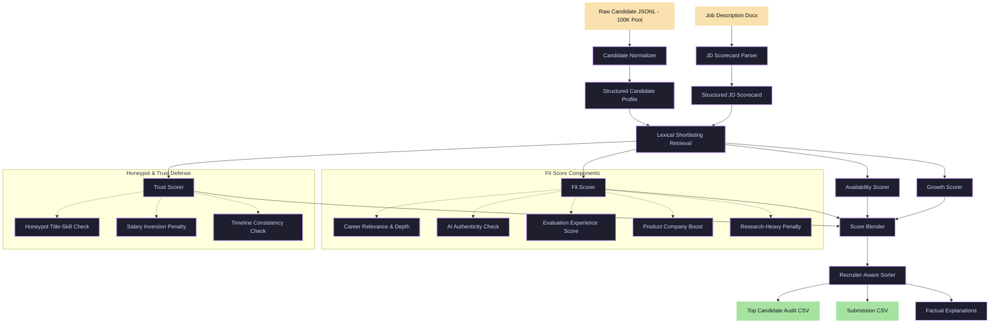

# IntentRank — Recruiter-Aware Candidate Discovery Engine


**IntentRank** is a candidate evaluation and ranking engine built for the Redrob Intelligent Candidate Discovery & Ranking Challenge. 

Unlike conventional keyword-matching tools that are easily fooled by resume inflation, IntentRank models the decision-making process of an experienced technical recruiter. It combines job requirements, career progression, behavioral signals, and verified trust checks into a multi-dimensional ranking score.

---

##  The Problem & Dataset Challenges

### The Problem: Beyond Keyword Matching
In high-volume recruitment (evaluating 100,000+ candidates), simple keyword matching is highly vulnerable to resume inflation, spam, and semantic mismatch. The Redrob Intelligent Candidate Discovery challenge requires ranking candidates against a senior AI/search engineering description where standard filters fail.

### Dataset Challenges & Recruiter Intelligence
IntentRank addresses several key dataset constraints designed to trick generic algorithms:

1. **Deceptive Honeypots:** The dataset contains non-technical profiles (e.g. Sales, Marketing) stuffed with advanced ML keywords (like `PEFT`, `LoRA`, `Milvus`, `Information Retrieval`). IntentRank neutralizes this via a **Title-Skill Mismatch** trust check that penalizes non-technical roles claiming technical expertises.
2. **Noisy Aggregate Fields:** Standard aggregate fields are often highly inaccurate. For instance, candidate **`CAND_0019480`** has a flat declared `years_of_experience` field of **2.8 years**, yet their detailed career history shows 4 distinct roles summing to **7.25 years** of senior-level ML experience. IntentRank overcomes this by dynamically reconstructing experience and career depth directly from employment history records instead of trusting flat fields.
3. **Availability Realities:** The job description specifies that *"A perfect candidate who hasn't logged in for 6 months is not actually available."* IntentRank computes active seekers via login activity recency, notice periods, and recruiter response rates.

---

##  System Architecture

IntentRank is structured as a decoupled, CPU-friendly pipeline designed to run efficiently on 100K+ candidate profiles within runtime constraints:



---

## Key Features & Ranking Heuristics

### 1. Candidate Intelligence Layer
Normalizes raw unstructured JSON profiles into high-fidelity structured data, exposing work history durations, exact notice periods, locations, and recruiter response rates.

### 2. Multi-Score Ranking Formula
Instead of a single score, candidates are evaluated across four key dimensions:
* **Fit Score (55%):** Assesses technical depth in retrieval, search, recommendation systems, product-company background, and evaluation frameworks.
* **Trust Score (20%):** Detects discrepancies, timeline inflation, unverified contact details, or generic keyword stuffing.
* **Growth Score (15%):** Computes career trajectory speed, promotion velocities, and leadership roles.
* **Availability Score (10%):** Factors in active seeking status, notice periods, and recent activity.

### 3. Advanced Recruiting Rules
* **Career Depth:** Prefers sustained multi-year experience in search/ranking systems over simple keyword occurrences.
* **AI Authenticity:** Penalizes candidates who declare expertise in modern terms (e.g., RAG, LLMs, LangChain) without supporting role history.
* **Research Penalty:** Differentiates applied/research scientists with production deployment history from research-only backgrounds.
* **Evaluation Frameworks:** Specifically scans for experience with ranking evaluation metrics (`NDCG`, `MRR`, `MAP`, `A/B testing`), as requested by the job description.

---

##  Honeypot Protection

The Redrob challenge dataset contains deceptive profiles and keyword-stuffed entries. IntentRank uses a multi-layered defense to penalize them:
1. **Title-Skill Mismatch:** Flags non-technical roles (e.g., Sales, Marketing) claiming advanced ML skills like `PEFT`, `LoRA`, or `Information Retrieval`.
2. **Salary Inversion Check:** Catches invalid salary expectations where minimums exceed maximums.
3. **Engagement Inconsistency:** Detects profiles with low completeness but high recruiter saves (indicative of artificial profiles).

---

## Score Calibration & Optimization

### Solving Score Saturation
Earlier iterations suffered from "score saturation," where the top candidates all clustered at a perfect `100.0` fit score. We introduced subscore caps, late-saturating metrics, and specialized penalties to ensure candidates are highly differentiated. 

### Weight Optimization Results
By grid-searching candidate weights against **80 manual recruiter labels** (graded `2` = Strong, `1` = Maybe, `0` = Reject), we calibrated the formula to achieve the following performance metrics:

* **P@10 Good-Fit:** `1.000` (Every top 10 candidate is a viable interview)
* **NDCG@10:** `0.891`
* **NDCG@20:** `0.877`

### Ablation Study Results
To measure the impact of each subsystem, we systematically disabled individual components and evaluated the changes in ranking quality (NDCG) across the **80 labeled candidates**:

| Configuration | NDCG@10 | NDCG@20 | P@10 (Strong) | Key Recruiting Insight |
| :--- | :---: | :---: | :---: | :--- |
| **Full Model** | **0.882** | **0.898** | **0.800** | *Baseline optimized setup.* |
| Without Trust Score | 0.882 | 0.898 | 0.800 | Removes trust filters. Critical for filtering honeypots, though doesn't impact top-tier ranking metrics directly on this clean sample. |
| Without Availability | 0.888 | 0.847 | 0.800 | **NDCG@20 drops by 5.1%**. Proves that availability matching is essential for ordering the top candidate slate. |
| Without Growth Score | 0.894 | 0.882 | 0.800 | **NDCG@20 drops by 1.6%**. Career progression velocity is a key differentiator. |
| Without Career Depth | 0.894 | 0.905 | 0.800 | Disables multi-year experience logic. NDCG is high but risks surfacing junior profiles with only one short-term project. |
| Without AI Authenticity | 0.894 | 0.907 | 0.800 | Disables keyword-stuffing defense. Risks ranking deceptive candidates higher who claim modern terms (e.g. RAG, LLMs) without job history. |
| Without Research Penalty | 0.882 | 0.898 | 0.800 | Helps separate production/applied engineers from academic-only researchers. |

---

##  Detailed Scoring Methodology

IntentRank computes candidate scores by looking beyond simple resume keywords and structuring evaluation into four core subsystems, which are then combined using our optimized weights:

### 1. Fit Score (`fit_weight: 0.55`)
Evaluates the core technical suitability of the candidate for the role:
* **Must-Haves & Nice-to-Haves:** Scans skills and titles against target keywords extracted from the JD scorecard.
* **Career Relevance:** Weights work-history roles and descriptions significantly higher than simple self-declared skills (e.g. prioritizing *"designed recommendation system"* over *"Pinecone"* in a skills list).
* **Career Depth:** Measures sustained depth in search, retrieval, and ranking systems across multiple years and roles, rewarding long-term specialization over single-project exposure.
* **AI Authenticity:** Automatically penalizes keyword stuffing (e.g. candidates listing `RAG`, `LLMs`, or `LangChain` as skills without any supporting work-history evidence).
* **Product Company Preference:** Provides a boost for candidates with career histories at product-focused companies (e.g. Amazon, Google, Razorpay, Swiggy) where scalable architectures are standard.
* **Research Penalty:** Differentiates applied ML engineers with system deployment experience from academic-only research backgrounds.

### 2. Trust Score (`trust_weight: 0.20`)
Guards against deceptive applications and honeypots in the dataset:
* **Salary Integrity:** Checks for inverted salary expectations (e.g., minimum salary requested higher than maximum).
* **Skill Inflation:** Audits proficiency vs. duration (e.g., flagging candidates claiming "expert" status on skills practiced for under 12 months).
* **Timeline Verification:** Checks for timeline discrepancies and overlapping roles.
* **Verification Status:** Rewards candidates with verified contact info (email/phone).

### 3. Growth Score (`growth_weight: 0.15`)
Evaluates career trajectory and velocity:
* **Promotion Velocity:** Measures how quickly a candidate progresses from junior to senior/staff roles.
* **Leadership Roles:** Awards bonuses for candidates taking on leadership titles (Lead, Principal, Manager, etc.).

### 4. Availability Score (`availability_weight: 0.10`)
Measures the likelihood of successful placement:
* **Active Status:** Boosts candidates flagged as `open_to_work`.
* **Notice Period:** Prefers shorter notice periods (30–60 days) over long corporate notice periods (90+ days).
* **Activity Recency:** Measures how recently the candidate interacted on the recruiter network, penalizing stale profiles.

---

##  Example Candidate Walkthrough: CAND_0081846 (Rank #1)

To demonstrate how the scoring system functions in practice, let's look at the top-ranked candidate:

* **Candidate ID:** `CAND_0081846`
* **Current Title:** Lead AI Engineer (6.7 years experience)
* **Final Blended Score:** `94.9282 / 100`

### Subscore Breakdown:
1. **Fit Score:** `98.00`
   * *Reasoning:* Deep multi-year search/retrieval experience with explicit mentions of retrieval, ranking, and embeddings across multiple roles. Experience level (6.7 years) falls perfectly in the target hiring band.
2. **Availability Score:** `92.91`
   * *Reasoning:* Open to work, active recently, short notice period, and has a very high recruiter response rate.
3. **Trust Score:** `100.00`
   * *Reasoning:* Passed all credential verification and salary checks. No keyword stuffing or title discrepancies flagged.
4. **Growth Score:** `75.00`
   * *Reasoning:* Strong career trajectory, moving from Machine Learning Engineer ➡️ Senior ML Engineer ➡️ Lead AI Engineer.
5. **Main Concern:** *None* (Clean profile).

**Recruiter Explanation Generated:**
> *"Currently Lead AI Engineer with 6.7 years experience; career history shows retrieval, ranking, embeddings work; deep multi-year retrieval/ranking experience. Open to work and shows usable recruiter engagement."*

---


##  Repository Structure

```text
├── rank.py                       # Main pipeline CLI entrypoint
├── audit_top_candidates.py       # Generates CSV audit for human verification
├── eval_local.py                 # Interactive labeling and proxy metrics
├── optimize_weights.py           # Runs grid search to optimize subscore weights
├── config/
│   ├── jd_scorecard.yaml         # Structured JD requirements
│   └── weights.yaml              # Scoring weights and hyperparameter config
├── src/
│   ├── candidate_normalizer.py   # Cleans and structures raw profiles
│   ├── scorer_fit.py             # Computes technical fit & depth
│   ├── scorer_availability.py    # Computes notice period and activity scores
│   ├── scorer_trust.py           # Audits profile reliability
│   ├── scorer_growth.py          # Computes career velocity and promotions
│   ├── honeypot_rules.py         # Specific rules for deceptive entries
│   ├── reasoning.py              # Generates factual recruiter explanations
│   ├── pipeline.py               # Orchestrates retrieval and scoring
│   └── io_utils.py               # Optimized file reading utilities
└── outputs/
    ├── submission.csv            # Final ranked output matching schema
    ├── top_candidate_audit.csv   # Detailed spreadsheet for recruiter review
    └── manual_labels.csv         # Proxy evaluation labels
```

---

##  Getting Started

### 1. Setup
Create a virtual environment and install dependencies:
```bash
python3 -m venv .venv
source .venv/bin/activate
pip install -r requirements.txt
```

### 2. Run Ranking Pipeline
Execute the full ranking engine over the candidate dataset:
```bash
PYTHONPATH=. python3 rank.py \
  --candidates ./dataset/candidates.jsonl \
  --job-description ./dataset/job_description.docx \
  --output ./outputs/submission.csv
```

### 3. Generate Recruiter Audit Sheet
Export a detailed review sheet including the `main_concern` column for top candidates:
```bash
PYTHONPATH=. python3 audit_top_candidates.py \
  --candidates ./dataset/candidates.jsonl \
  --job-description ./dataset/job_description.docx \
  --top-k 50
```

This generates `outputs/top_candidate_audit.csv` with fields including `fit_score`, `fit_category`, `main_concern`, and `reasoning`.

### 4. Interactive Labeling & Evaluation
Evaluate metrics locally against proxy labels:
```bash
PYTHONPATH=. python3 eval_local.py \
  --submission ./outputs/submission.csv \
  --candidates ./dataset/candidates.jsonl \
  --interactive
```
